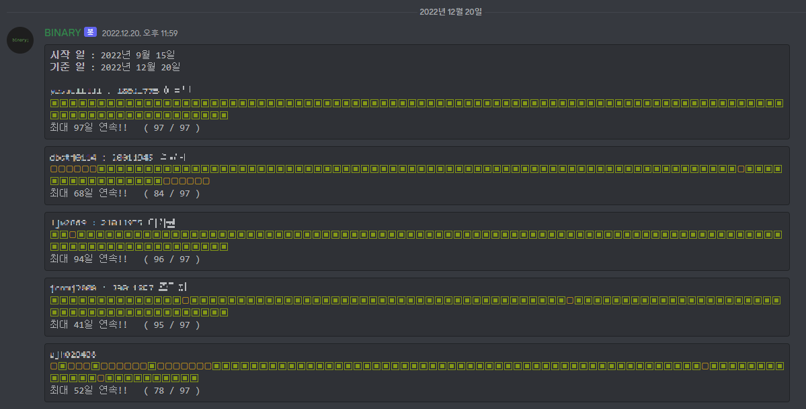

# Binary-Discord-Bot
### 세종대학교 지능기전공학부 학술 동아리 바이너리 디스코드 봇

---

## 기능
1. 백준 그룹 크롤링
    - Online Judge 웹 사이트 백준의 그룹 ID를 기준으로  
    그룹원의 문제 풀이 현황을 크롤링한다.
    - 사전에 입력된 시작일을 기준으로 현재까지 문제 종류 및 난이도에 상관없이 
    몇 문제를 풀었는지 크롤링하여 discord 채팅창에 멤버별로 보여준다.

 

## 명령어

!잔디 : 잔디와 관련된 명령어를 보여줌 (아래)   
!잔디 시작일 : 입력 날짜를 기준으로 현황을 보여줌  
(ex !잔디 시작일 20220328)  
!잔디 그룹 : 그룹 ID를 입력하여 해당 그룹의 그룹원을 크롤링 할 수 있도록 함 
(ex !잔디 그룹 13898)  
!잔디 추가 : 그룹원의 백준 ID에 사용자의 입력을 추가하여 출력할 수 있도록 함  (ex !잔디 추가 binary01 18011821이진수)  
!잔디 제외 : ID를 입력하여 해당 ID가 현황에 출력되지 않도록 함 
(ex !잔디 제외 binary01)  
!잔디 현황 : 시작일을 기준으로 현재 날짜까지 그룹원의 문제풀이 현황을 출력함 

